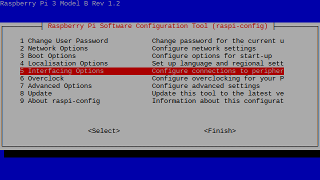
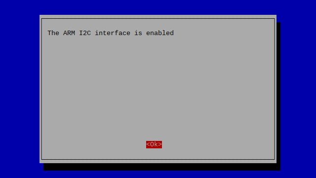
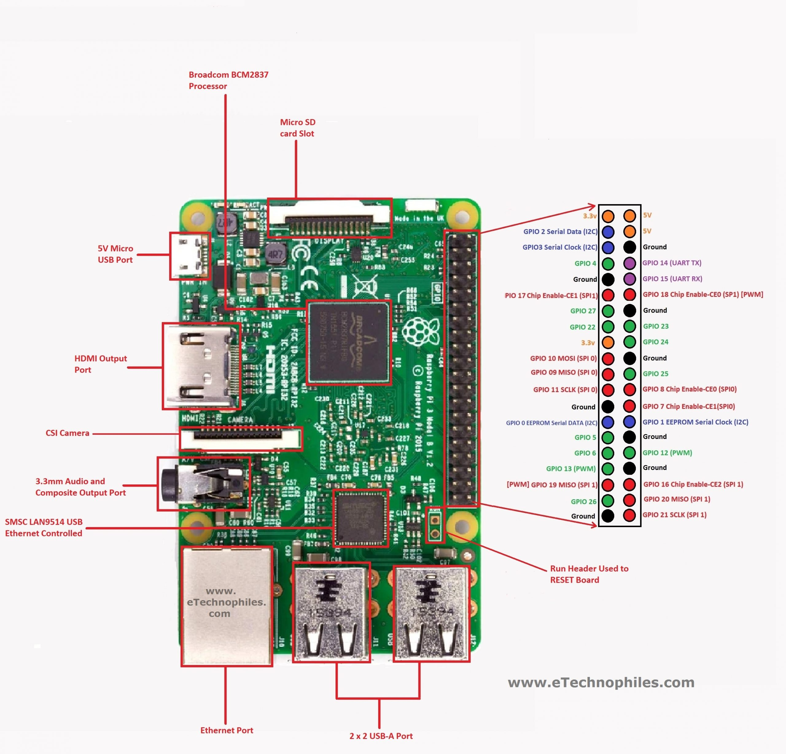

<p align="center">
  <a href="" rel="noopener">
 </a>
</p>

<h3 align="center">SmartQuadCamera</h3>

<div align="center">

[]()


</div>

---


<p align="center"> SmartQuadCamera
    <br> 
</p>

## 📝 Table of Contents

- [About](#about)
- [Getting Started](#getting_started)
- [Prerequisites](#deployment)
- [Installation and Config](#Installation_and_Config)
- [Test](#test)
- [Circuit](#circuit)
- [Dashboard](#dashboard)
- [Built Using](#built_using)
- [Authors](#authors)

## 🧐 About <a name = "about"></a>

This repo contains circuit, firmware and backend for SmartQuadCamera Project.

## 🏁 Getting Started <a name = "getting_started"></a>

These instructions will get you a copy of the project up and running on your local machine for development and testing purposes. See [deployment](#deployment) for notes on how to deploy the project on a live system.

### Prerequisites <a name = "Prerequisites"></a>

What things you need to install the software and how to install them.

```
- Raspberry Pi Model 4 (8GB)
```

## Installation and Configuration <a name = "Installation_and_Config"></a>

A step by step series that covers how to get the Firmware running.

### Raspberry Pi Firmware Pre-Reqs

  ```diff
  - Make sure you are running a newer version of Raspberry Pi OS, a fresh install is highly recommended.
```

1.  Download and install the latest Raspberry Pi OS Desktop image to your SD card
2.  Open the terminal and execute the following command
    ```sudo raspi-config```
3. Then follow the following pictures to enable I2C bus on you raspberry pi

* 
* 
* 
* 
* 

* Then do the same for Serial(UART)

* 

 ```diff
 + And do the same for SPI, SSH and Camera
```

4. Restart the Raspberry Pi.

### Configuring Raspberry Pi and Running the UI
  1.  Copy FirmwareRPi folder to the `/home/pi/` of your Raspberry Pi, open the terminal of your Raspberry Pi and execute the following commands

```bash
  - sudo apt-get update
  - sudo apt-get upgrade
  - sudo apt install python3-pip
  - pip3 install paho-mqtt
  - sudo adduser $USER dialout
  - pip3 install pynmea2
  - sudo pip3 install pynmea2
  - sudo cp gpsSensor.service /lib/systemd/system/
  
```

### Camera Drivers Installation

```bash
- cd ~
- wget -O install_pivariety_pkgs.sh https://github.com/ArduCAM/Arducam-Pivariety-V4L2-Driver/releases/download/install_script/install_pivariety_pkgs.sh
- chmod +x install_pivariety_pkgs.sh 
- ./install_pivariety_pkgs.sh -p libcamera_dev
- ./install_pivariety_pkgs.sh -p libcamera_apps
- ./install_pivariety_pkgs.sh -p 64mp_pi_hawk_eye_kernel_driver
```

Open `/boot/config.txt` using `sudo nano /boot/config.txt`, under `[all]`, add the following line:

* `dtoverlay=vc4-kms-v3d,cma-512`

Example:

```bash
[all]
# Run as fast as firmware / board allows
arm_boost=1
dtoverlay=vc4-kms-v3d,cma-512

```

### Testing the Cameras

1. Previewing the camera

```bash
libcamera-still -t 0 --viewfinder-width 2312 --viewfinder-height 1736
```
* --viewfinder-width
  Set the width of the preview resolution.

* --viewfinder-height
  Set the height of the preview resolution.

2. Taking a picture with autofocus enabled

```bash
libcamera-still -t 5000 --viewfinder-width 2312 --viewfinder-height 1736 -o pi_hawk_eye.jpg --autofocus
```

`By default, the quad-camera kit works in synchronized 4-channel mode (more modes will
be added in future updates), and Raspberry Pi recognizes the whole kit as one camera.
Any manual focus or camera control adjustments (exposure/gain/white balance/etc.) will
also be applied to 4 cameras at the same time.`

There are four channels available with the quad-camera kit. Each channel represents a camera, and you
can switch channels to achieve different camera composition modes, including single-channel,
dual-channel, and the default four-channel.
1. Set to single channel 0
`i2cset -y 10 0x24 0x24 0x02`
2. Set to single channel 1
`i2cset -y 10 0x24 0x24 0x12`
3. Set to single channel 2
`i2cset -y 10 0x24 0x24 0x22`
4. Set to single channel 3
`i2cset -y 10 0x24 0x24 0x32`
5. Set to double channel (single channel 0 and single channel 1)
`i2cset -y 10 0x24 0x24 0x01`
6. Set to double channel (single channel 2 and single channel 3)
`i2cset -y 10 0x24 0x24 0x11`
7. Set to four in one mode (Default)
`i2cset -y 10 0x24 0x24 0x00`

After setting the channel, you can use `libcamera` apps to run the camera.


### Installing and Configuring Node-RED on Raspberry Pi

Conifguring NodeRED, MQTT is required only one time.

Open the terminal and execute the following commands

```
- sudo apt install ufw
- sudo ufw enable
- sudo ufw allow tcp http https 1883 8883 1880 80 8080 443
```
##### Installing MQTT(Mosquitto)
Open the terminal and execute the following commands

```
- sudo apt install -y mosquitto mosquitto-clients
- sudo systemctl enable mosquitto.service
- mosquitto -v
```
##### Installing and Configuring NodeRED
Open the terminal and execute the following commands

```
- bash <(curl -sL https://raw.githubusercontent.com/node-red/linux-installers/master/deb/update-nodejs-and-nodered)
- sudo systemctl enable nodered.service
- npm install node-red-dashboard 
- sudo npm install node-red-dashboard
- sudo systemctl restart nodered.service
```
Then open NodeRED in your raspberry pi or using any other device which is connected to the same network
as your Raspberry Pi is.
In the browser you can type http://raspberrypi.local:1880 to open the node-red

- Once node-red is opened, click on the menu button on the top left corner of the app and click on import.
- Click on `select file to import` and select `flows.json` present in the `dashboard` directory of this repo.
- After flows are imported, click on Deploy button on the top of the screen to save the changes.
- You can access the Dashboard using http://raspberrypi.local:1880/ui


1.  To run the program just restart the raspberry pi.

This program make use of MQTT to communicate with the webapp.

  ```diff
  + broker used is mosquitto, deployed on the Raspberry Pi.
  + vending can be done by publishing an ammount to mdb/invoke topic
  ```


## ⛏️ Testing <a name = "test"></a>

1.  The Firmware can be tested on Raspberry Pi 3B, 3B+ or 4B with the following modifications
  1.  Connect the sensor as shown in the Circuit Diagram section below.

## 🔌 Circuit Diagram <a name = "circuit"></a>

<!--  -->

### Connecting Quad Camera Kit

1. Connect the HAT’s MIPI_TX0 port to Raspberry Pi’s camera port.


2. Connect the Quad-Camera HAT.


3. Connect the 4 camera modules to the Rx ports.


### Connecting GPS


* RPi 3,4 GPIOs Reference Pinout



Power your Raspberry Pi on.

### Circuit

```http
Pins connections
```

| GPS | Raspberry Pi |
| :--- | :--- |
| `VCC` | `5V` | 
| `GND` | `GND` |
| `TX` | `RX(GPIO15)` | 
| `RX` | `TX(GPIO14)` | 


## Dashboard <a name = "dashboard"></a>


  ```diff
  - This is Milestone 2 and no developed yet. 
  ```

You can use the dashboard with the link below:

[]()

<!--  -->


  ```diff
  - The dashboard is running on Raspberry Pi. 
  ```

  <!-- 
  
  
  
   -->


## Components Used

1.  [Raspberry Pi](https://www.amazon.co.uk/SANOOV-Raspberry-Pi-Motherboard-Screwdiver/dp/B0BF58GQD4/ref=sr_1_1_sspa?crid=2BHVW7XD7RENW&keywords=raspberry+pi+4&qid=1667034192&qu=eyJxc2MiOiI1LjUxIiwicXNhIjoiNS41MCIsInFzcCI6IjQuNjgifQ%3D%3D&sprefix=raspberry+pi+4%2Caps%2C100&sr=8-1-spons&psc=1)
2. [Quad Camera Kit](https://www.arducam.com/product/64mp-quad-camera-kit/)
3. [GPS Module](https://www.amazon.co.uk/FUQUANDIAN-GY-NEO6MV2-Flight-Controller-Raspberry/dp/B09ND9SX8J/ref=sr_1_12?crid=1ETIQ6V4XZW3L&keywords=raspberry+pi+gps+module&qid=1667034390&qu=eyJxc2MiOiIzLjQ5IiwicXNhIjoiMy4yOSIsInFzcCI6IjEuNTkifQ%3D%3D&sprefix=gps+module+ras%2Caps%2C92&sr=8-12)
4. [4G LTE USB Dongle](https://www.waveshare.com/sim7600g-h-4g-dongle.htm)
5. [Raspberry Pi UPS - Pi Sugar 3](https://www.amazon.co.uk/Portable-Platform-Raspberry-Accessories-Handhold/dp/B09QRS666Y/ref=sr_1_2?crid=3HWT3GFC18CCK&keywords=pisugars+plus&qid=1667036487&sprefix=pisugar+s+plus+%2Caps%2C84&sr=8-2)

## ⛏️ Built Using <a name = "built_using"></a>

- [Python3](https://www.python.org/) - Raspberry Pi FW
- [Node-RED](https://nodered.org/) - Platform for creating dashbaords and backend logic
- Bash

## ✍️ Authors <a name = "authors"></a>

- [@Nauman3S](https://github.com/Nauman3S) - Development and Deployment
